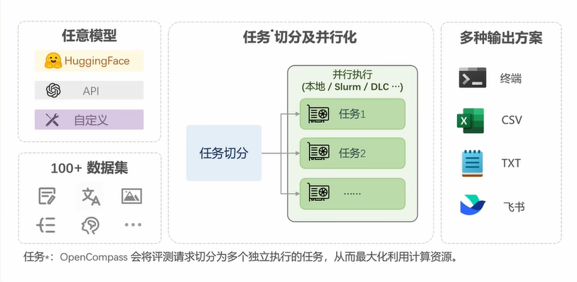

## OpenCompass
### 模型评测
#### 1.1 LLM评测中的挑战
全面性 评测成本 数据污染 鲁棒性
#### 1.2 OpenCompass评测方法
基座模型：海量数据无监督训练

对话模型：指令数据有监督微调（SFT），人类偏好对齐（RLHF）

公开权重的开源模型：使用GPU/推理加速卡进行本地推理

API模型：发送网络请求获取回复

#### 1.3 客观评测与主观评测
客观问答题，客观选择题，开放式主观问答题

#### 1.4 提示词工程
明确性、概念无歧义、逐步引导、具体翻译、迭代反馈、小样本学习、思维链技术

#### 1.5 长文本评测
指令跟随能力、长文本建模能力、信息抽取能力

#### 1.6 OpenCompass评测流水线

