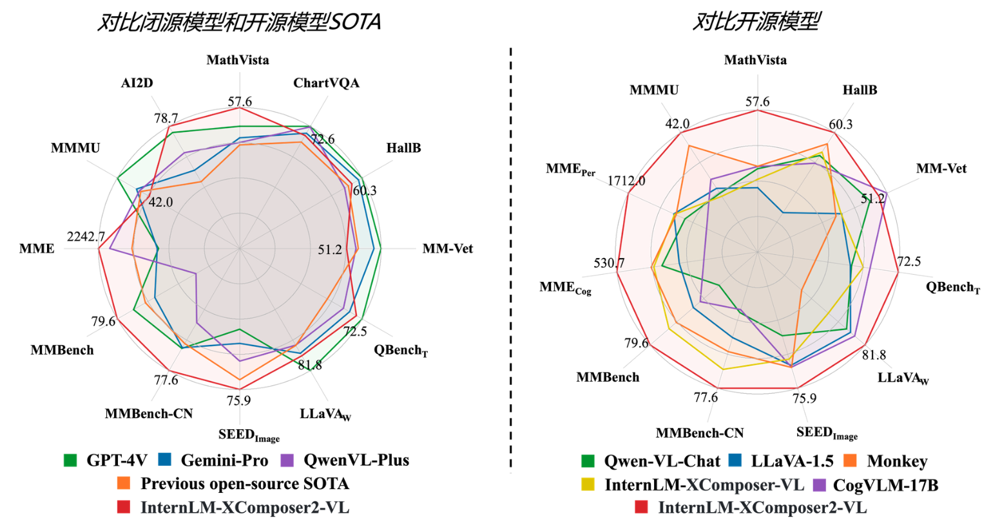

## 轻松玩转书生·浦语大模型趣味Demo

### 1. 趣味Demo任务列表
本节课让学生实践4个主要内容：
- 部署InternLM2-Chat-1.8B模型进行智能对话
- 部署优秀项目八戒-Chat-1.8B模型
- 使用InternLM2-Chat-7B运行Lagent智能体Demo
- 实践部署浦语·灵笔2模型

### 2. 部署InternLM2-Chat-1.8B模型进行智能对话
#### 2.1 配置基础环境
- 在Intern Studio配置开发机。
- 使用Cuda11.7-conda镜像，选择10% A100 * 1资源配置。
- 进入开发机后，在终端配置环境。

```bash
studio-conda -o internlm-base -t demo
# 或者
conda create -n demo python==3.10 -y
conda activate demo
conda install pytorch==2.0.1 torchvision==0.15.2 torchaudio==2.0.2 pytorch-cuda=11.7 -c pytorch -c nvidia
```

- 激活新的conda环境，安装必要的包。

#### 2.2 下载InternLM2-Chat-1.8B模型
- 创建文件夹，进入目录。
```bash
mkdir -p /root/demo
touch /root/demo/cli_demo.py
touch /root/demo/download_mini.py
cd /root/demo
```
- 下载模型参数。

#### 2.3 运行cli_demo
- 执行demo程序，与模型互动。

### 3. 部署优秀项目
#### 3.1 介绍八戒-Chat-1.8B等模型
- 简介在第一期实战营中开发的八戒-Chat-1.8B等模型。

#### 3.2 配置基础环境
- 设置环境，克隆仓库获取demo文件。

#### 3.3 下载并运行Chat-八戒Demo
- 执行下载脚本，运行聊天demo。

### 4.实战：使用 Lagent 运行 InternLM2-Chat-7B 模型
#### 4.1 初步介绍 Lagent 相关知识
Lagent 是一个基于大语言模型的轻量级、开源智能体框架，支持快速转变为多种类型的智能体，并提供典型工具赋能。

#### 4.2 配置基础环境
启动开发机，激活环境，克隆并安装 Lagent。
#### 4.3 使用 Lagent 运行 InternLM2-Chat-7B 模型为内核的智能体
设置软链接，运行模型，连接到服务器，访问页面。

### 5.部署 浦语·灵笔2 模型
#### 5.1 初步介绍 XComposer2 相关知识
浦语·灵笔2 基于书生·浦语2 大语言模型，具有图文写作和图像理解能力。

#### 5.2 配置基础环境
激活环境，安装必要的包，克隆代码，设置软链接。

#### 5.3 图文写作实战
启动图文写作模型。
#### 5.4 图片理解实战
关闭并重新启动一个新的 terminal，继续输入指令，启动图片理解模型。

