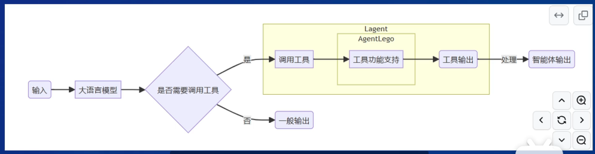

## Lagent & AgentLego 智能体应用搭建
### 智能体

#### 1.1 智能体定义
可以感知环境中的动态条件

能采取动作影响环境

能运用推理能力理解信息、解决问题、产生推断、决定动作

#### 1.2 智能体组成
大脑：控制器

感知：传感器

动作：调用相关API

#### 1.3 AutoGPT
输入->选择工具->人工干预->执行工具

#### 1.4 ReWpp
输入->计划拆分->DAG->计划执行 （graph）

#### 1.5 ReAct
输入->选择工具->执行工具 （推理+行为）

### Lagent

 
